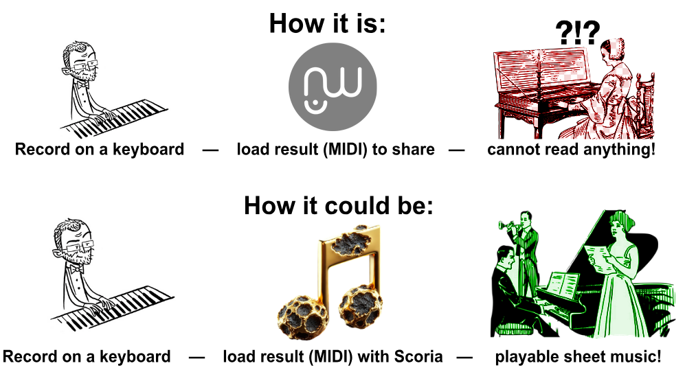
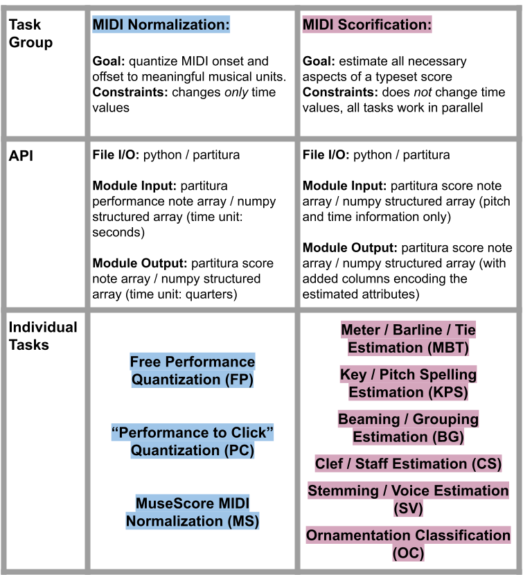

# SCORIA: International Thesis Project & Open-Source Collaboration

---
## October '24: We Are Currently Looking For Students To Join This Project! Are You Interested? -> at Johannes Kepler University write to [Silvan Peter](silvan.peter@jku.at), at Charles University: write to [Jan Hajič jr.](hajicj@ufal.mff.cuni.cz)

---
## What is scorification?
Music scorification is the process to get from a symbolic MIDI recording to a readable score, that is, to estimate the quantization of onsets and offsets into musical time and to estimate meter, key, voice, and several more attributes. Scorification is a hard technical problem for which no satisfactory solutions exist yet.

## What is SCORIA?
SCORIA is a scorification project. We aim to create a complete pipeline to automatically and beautifully typeset scores from recorded MIDI data. This is a huge undertaking encompassing many music information retrieval tasks. To make it manageable, we break this goal down into challenging subtasks, each addressed in its own thesis.

SCORIA is an international collaborative thesis project involving the Institute of Computational Perception at Johannes Kepler University in Linz, Austria and the Prague Music Computing Group at Charles University in Prague, Czechia. Through this collaboration, we aim to advance research in scorification while contributing to open-source development.

[Download Information Document](./assets/pdf/SCORIA_ thesis project information for students.pdf){: .btn }
[Download Project Poster](./assets/pdf/one-pager.pdf){: .btn }

---
## Why Scorification?

Scorification for **music practice reasons**: notation editors struggle to produce readable scores from recorded MIDI files and manually fixing such scores is very tedious. A good scorification tool would be very welcome!

Scorification for **scientific reasons**: scorification assembles several of the most interesting and challenging tasks in computational music analysis and processing, which makes it an ideal playground for researchers and theses!

Watch the video to see how a SCORIA could help with music notation:

<iframe width="420" height="315" src="./assets/vid/scoria_video_0.mp4" frameborder="0" allowfullscreen></iframe>

---
## Research Areas & Tasks
**Scorification** is the process of transforming a real-life MIDI recording into a quantized, typeset musical score. This can be divided into two key areas: **MIDI Normalization** and **MIDI Scorification**:
- **MIDI Normalization** focuses on time-related aspects, such as quantizing note onsets and durations. The main objective is to adjust the timing of MIDI events (onsets and offsets) to align with meaningful musical values, like beats and note lengths.
- **MIDI Scorification** deals with all other musical elements and attributes required for a readable typeset score. This includes estimating the correct time and key signatures, clef and staff placement, voice assignments, note stemming, and classifying musical ornamentation.

### Nine Challenging Thesis Topics
To make both MIDI Normalization and MIDI Scorification more accessible and approachable, we have broken both areas into the following subtopics and related tasks (click on them for detailed description):
1. **MIDI Normalization**: [Free Performance Quantization (FP)](#free-performance-quantization-fp)
2. **MIDI Normalization**: [Performance to Click Quantization (PC)](#performance-to-click-quantization-pc)
3. **MIDI Normalization**: [MuseScore MIDI Normalization (MS)](#musescore-midi-normalization-ms)
4. **MIDI Scorification**: [Meter / Barline / Tie Estimation (MBT)](#meter--barline--tie-estimation-mbt)
5. **MIDI Scorification**: [Key / Pitch Spelling Estimation (KPS)](#key--pitch-spelling-estimation-kps)
6. **MIDI Scorification**: [Beaming / Grouping Estimation (BG)](#beaming--grouping-estimation-bg)
7. **MIDI Scorification**: [Clef / Staff Estimation (CS)](#clef--staff-estimation-cs)
8. **MIDI Scorification**: [Stemming / Voice Estimation (SV)](#stemming--voice-estimation-sv)
9. **MIDI Scorification**: [Ornamentation Classification (OC)](#ornamentation-classification-oc)

These tasks have their respective I/O requirements depending on key area:

---
### MIDI Normalization
#### Free Performance Quantization (FP)
Free performance quantization involves processing a MIDI recording of a performance that doesn’t follow a strict tempo (e.g., a live, expressive piano performance) and aligning the timing of the notes to a structured, musical grid. The challenge here is preserving the nuances of the performance while still making the timing conform to standard musical values (e.g., quarter notes, eighth notes). This task requires creating algorithms that intelligently adjust note onsets and durations while maintaining the musical expressiveness of the original performance.
#### Performance to Click Quantization (PC)
In performance to click quantization, the goal is to quantize a MIDI performance that was played with a metronome. This is simpler than the free performance task, but by no means trivial. It involves adjusting the note onset timings to sensibly quantize to musical units and estimating note values.
#### MuseScore MIDI Normalization (MS)
MuseScore MIDI normalization refers to developing methods to process and clean up MIDI data produced by [MuseScore](https://musescore.org/en), a popular open-source music notation software. MuseScore produces MIDI files that incorporate articulation, tempo marking, and other score attributes which leads to files that are deterministically different from the score. This is the easiest of the normalzation tasks, but also not to be underestimated: it likely involves reverse engineering the MuseScore MIDI rendering engine and gaining an in depth understanding of MIDI processing.

---
### MIDI Scorification

#### Meter / Barline / Tie Estimation (MBT)
In this task, the focus is on detecting the meter (time signature), barlines (measure divisions), and ties (which connect notes across bars) from MIDI data. Since MIDI data doesn’t inherently include this information, the challenge is to analyze the timing and rhythmic structure of the notes to infer where the barlines should be placed and how notes should be tied across them. The aim is to ensure that the score reflects a musician's intuitive understanding of meter and phrasing.
#### Key / Pitch Spelling Estimation (KPS)
This task involves estimating the key signature and determining the correct pitch spelling for each note in the MIDI data. While MIDI data represents pitches with numerical values, translating them into musical notation requires understanding which pitches should be spelled as sharps, flats, or naturals (e.g., determining if a pitch is C# or Db). The task also includes identifying local changes in key signature, which influence local adjustments in pitch spelling and make the score easier to read and interpret.
#### Beaming / Grouping Estimation (BG)
Beaming refers to grouping notes together with beams (horizontal lines connecting note stems) in a way that visually reflects the rhythmic structure of the music. This task focuses on automatically determining how notes should be grouped together, especially in faster rhythms like eighth notes or sixteenth notes. The goal is to make the score visually clear and musically logical, following standard notational conventions for grouping notes within beats and measures.
#### Clef / Staff Estimation (CS)
In MIDI standard notation, notes are not assigned to specific clefs or staves (e.g., treble, bass). This task involves analyzing the pitch range of the notes and determining the most appropriate clef and staff assignment. For instance, higher notes are typically placed on the treble staff, while lower notes go on the bass staff. This estimation ensures that the resulting score is readable and follows conventional music notation practices.
#### Stemming / Voice Estimation (SV)
Stemming refers to deciding the direction of note stems (up or down), which helps visually organize the score, especially in polyphonic music. Voice estimation involves assigning notes to separate musical voices or parts when multiple lines of music are being played simultaneously (e.g., in piano music with independent left and right-hand parts). This task is about properly assigning notes to different voices and determining the correct stem directions to clearly represent multiple musical lines within a single staff.
#### Ornamentation Classification (OC)
This task focuses on detecting and classifying ornamentation—decorative musical elements such as trills, grace notes, or mordents—that are often present in performance recordings but not explicitly encoded in MIDI data. The challenge is to identify when and where these ornaments occur and then properly represent them in the musical score using appropriate score onset and duration values. This ensures the score is both accurate and consistent, while (more) closely reflecting the nuances of the intended performance.

---

## Administrative Stuff!

**How can I join SCORIA and write my thesis with you?** 

Pick a facorite research topic and task and send us an email. 
Or just send us an email, and we figure out what task is suitable for you together.
See contact info for each institute at the bottom of the page.
Do this as soon as possible, we hope to distribute all topics by **by October 24, 2024**!

**What does the process look like if I join SCORIA?** 

1. **Student Enrollment**:
Select a research topic in discussion with us
2. **Mentor Assignment**:
You get a thesis (co-)supervisor that is a domain expert and can provide guidance and supervision.
3. **Scientific Literature Search**:
You start reading traditional and state-of-the-art works to thoroughly understand your topic.
4. **Technical Project Integration**:
You set up the necessary codebase for your task, implement a baseline, and integrate it with our pipeline API.
5. **Collaboration & Feedback**:
Regular mentorship sessions with your supervisor ensure steady progress. Less often full team meetings with all collaborators. 
6. **Technical Implementation**:
You pick at least one suitable method and implement it to interface with the pipeline API.
7. **Thesis Experiments and Writing**:
You develop a thesis with your supervisor, carry out and document your experiments and approach.
8. **Final Submission & Contribution**:
Each thesis work contributes to the open-source scorification pipeline, which will be released around September 2025. 

**What should my thesis look like in the end?** 

The goal of each thesis is to: 
- give a comprehensive overview of both traditional and machine learning based approaches to the topic
- (re)implement or adapt one state-of-the-art algorithm to work within the API specification of SCORIA
- finish at latest by September 2025, when we’ll assemble all parts and release the scorification tool

**Why should I join the SCORIA project?** 

We offer you: 
- interesting and challenging music AI tasks
- supervision and regular metnoring meetings by experts in the field
- collaborative work with peers across Czechia and Austria
- lasting contributions to an open source project beyond your own thesis
- a specified API for the pipeline
- a utility codebase for symbolic music processing python and data which gets you started on the task right away

**Which prerequites are necessary?** 

We need you to: 
- have a strong background in AI/ML/music computing
- be interested in music scores and their intricacies, and you must be able to read music
- be able and willing to complete a thesis within the time allotted.
- be interested in scorification :)

---
## Contact Us
If you’re interested in a task or thesis or just need more information, please reach out to:
- [Institute of Computational Perception](https://www.jku.at/en/institute-of-computational-perception/) / Johannes Kepler University: write to [Silvan Peter](silvan.peter@jku.at)
- [Prague Music Computing Group](https://ufal.mff.cuni.cz/prague-music-computing-group) / Charles University: write to [Jan Hajič jr.](hajicj@ufal.mff.cuni.cz)

       

